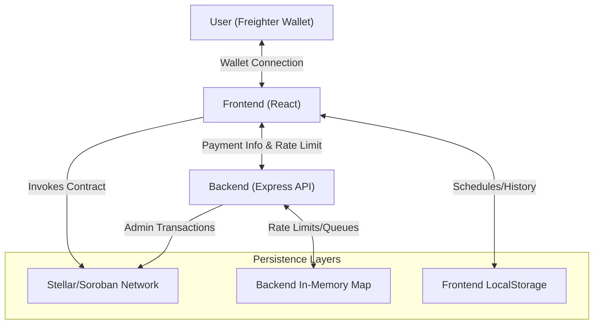
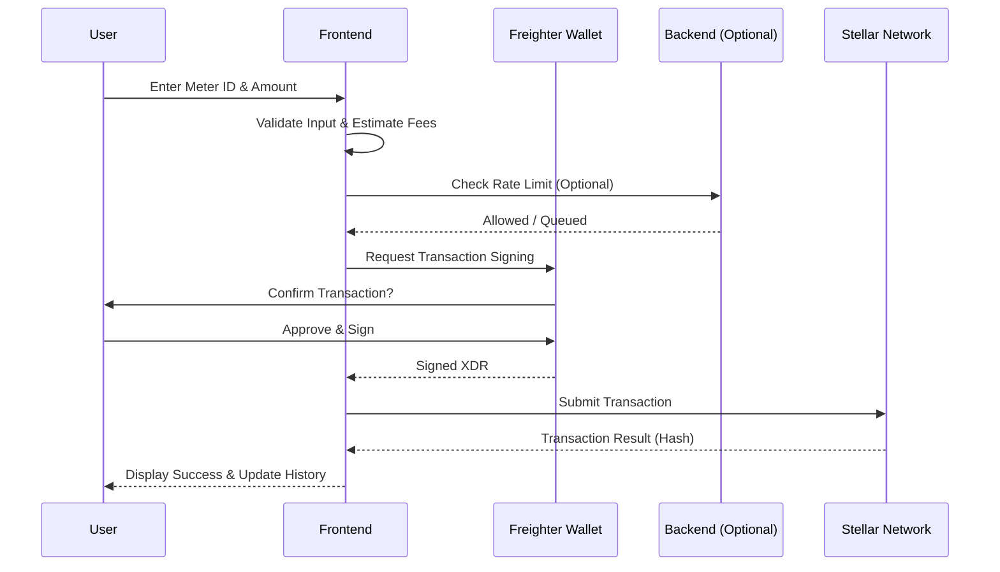

# Wata-Board Architecture Documentation

## 🏗️ System Overview
Wata-Board is a decentralized utility payment platform built on the **Stellar/Soroban** blockchain. It enables users to pay utility bills (water, electricity) using XLM through a secure and transparent process.

### Core Components
1.  **Smart Contract (Soroban)**: The primary ledger and logic layer for recording payments.
2.  **Backend (Node.js/Express)**: A secure service layer for rate limiting, admin operations, and proxying blockchain interactions.
3.  **Frontend (React + Vite)**: A responsive user interface with wallet integration and offline support.

---

## 🗺️ Component Architecture
The following diagram illustrates the high-level interactions between the system components.

---

## 🔄 Core Sequence: Payment Flow
This sequence shows how a payment is initiated, signed, and broadcast to the Stellar network.

---

## 🔩 Technical Specifications

### 1. Soroban Smart Contract
- **Contract ID**: `CDRRJ7IPYDL36YSK5ZQLBG3LICULETIBXX327AGJQNTWXNKY2UMDO4DA`
- **Methods**:
    - `pay_bill(meter_id: String, amount: u32)`: Records a payment.
    - `get_total_paid(meter_id: String) -> u32`: Returns cumulative XLM paid for a meter.

### 2. Backend API Reference
- `POST /api/payment`:
    - **Purpose**: Process payments with rate limiting and admin-side verification.
    - **Payload**: `{ meter_id: string, amount: number, userId: string }`
- `GET /api/payment/:meterId`:
    - **Purpose**: Fetch the total paid amount for a meter directly from the contract.
- `GET /api/rate-limit/:userId`:
    - **Purpose**: Retrieve current rate limit status for a specific user.

### 3. Frontend Hooks & Services
- `useWalletBalance`: Synchronizes the UI with the user's XLM balance.
- `useFeeEstimation`: Provides real-time fee calculation for transactions.
- `SchedulingService`: Manages local recurring payments using `localStorage`.

---

## 🛡️ Security & Infrastructure
- **HTTPS/SSL**: Automated certificate management via Let's Encrypt and Nginx.
- **CORS**: Strict origin whitelist for production environments.
- **Rate Limiting**: Backend-enforced limits (default: 5 requests per minute) to prevent spam.
- **Wallet Security**: Uses Freighter Bridge for secure, non-custodial transaction signing.

---

## 💾 Data Architecture
See [DATABASE_DOCUMENTATION.md](./DATABASE_DOCUMENTATION.md) for a detailed breakdown of the three-layer persistence strategy (Blockchain, LocalStorage, and In-Memory caches).

---
*Last updated: 2026-03-25*
